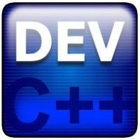

### Estructuras de datos  :date: :pushpin: :book: 
_Este repositorio se ha ido actualizando segun he ido cursando la materia de "Estructura de datos & Lab de Estructura de datos" en la universidad UCATECI._

###  Descripción General :white_check_mark:

En esta asignatura se abordan los temas correspondientes a las Estructuras de Datos tradicionales, es decir; la forma en que internamente son manejados los datos por el computador, realizando un estudio detallado de cada uno. Se desarrollan, además, un conjunto de algoritmos  provenientes de los conceptos derivados de la conceptualización que se socializa de los contenidos abordados y el resultado de esta socialización se plasman en las prácticas desarrolladas para alcanzar el propósito de la asignatura

###  Objetivos Generales :white_check_mark:
 Conocer el manejo y la lógica para el acceso de la información,  así como el desarrollo de  algoritmos que permitan la gestión de los datos, para que de esta manera pueda el estudiante seleccionar satisfactoriamente la estructura más idónea según los objetivos o planteamiento del problema ante una necesidad  determinada, que implique guardar y extraer los datos.

 ###  Proposito personal con el material de la clase :open_book: :pushpin:
 Aprender a desarrollar Algoritmo que faciliten la solución a problemas informáticos, mediante el Lenguaje de programación C, iniciando desde lo más particular, hasta llegar a lo general.

 ### Lenguajes de programacion utilizados :pushpin: 
  
 
 

### IDE

 
 
