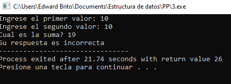

1. Realice un programa que simule las compras de un cliente en una tienda. El cliente comprará 3 productos distintos, cada uno en X cantidad. La tienda deberá dar; el subtotal, el Itebis correspondiente, y el total final. Por ser día de la Altagracia habrá un descuento del 20% sobre el total. Se le preguntará al usuario con cuanto pagará y se le informará cuál es su cambio.
* Entrada:  
   Producto1? 10   
  Producto2? 70   
  Producto3? 20 
* Salida:  
El Subtotal de tu compra es: 100 El Itebis es: 15  
El Total: 115  
Descuento: 23  
El Total Final es: 92   
Con cuanto pagas? 100  
    Tu cambio es: 8
 

 

1. Realice un programa en C, que pida la entrada por teclado, del radio, dato (Float) de una circunferencia y calcule el perímetro de la circunferencia, sabiendo que la formula del perímetro = 2 * PI * R, EL PI declararlo como una constante. La salida por pantalla debe ser (Float). Con IF Else
 

 
3. Realizar un programa que lea un dato entero por teclado y muestre por pantalla el múltiplo de 6. Si el numero introducido es divisible entre 6 desplegara, Es múltiplo de 6, de lo contrario No es múltiplo de 6 Con IF Else.
 

 
4. Realizar un programa en C, que pida dos números entero por pantalla, preguntarle al usuario la suma de los dos números. Si usuario responde correcto, desplegar por pantalla “ Su respuesta es correcta” , de lo contario “ Su respuesta es Incorrecta” y le presenta la suma correcta. Con IF Else.
 

 
5.  Realizar un programa en C que muestre por pantalla los nombres de los discípulos de Jesucristo, al elegir un numero de la lista, muestre por pantalla como murió este discípulo. Nota: si coloca un numero distinto al listado presentado en pantalla, que salga un mensaje de error que diga: “este numero no está asociado a ningún discípulo de Jesucristo.” https://masfe.org/temas/para-meditar/muerte-doce- apostoles/ . Este programa debes realizarlo Con IF y SWICTH, donde el IF evaluara si número es mayor = 1 y número es Menor= 12. Entonces entra al SWICTH. Corrida del Programa.
 

 
6. Dadas las variables de tipo entero con valores A = 5, B = 3, C = -12 indicar si la evaluación de estas expresiones daría como resultado verdadero o falso:
 

 