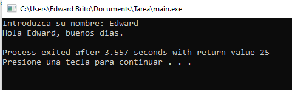
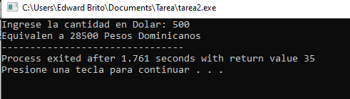
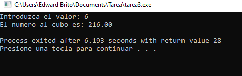
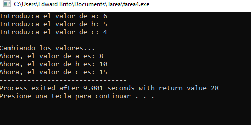
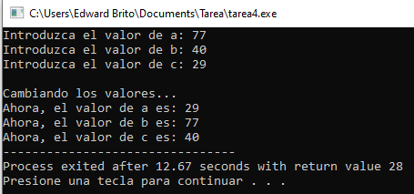
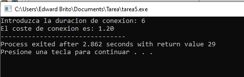
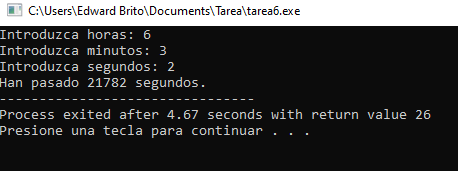

1.  Utilizando el tipo de Datos char, realizar un programa que le salude cuando usted entre su nombre.
  

 

2. Utilizando el tipo de datos Int, realizar un programa que introducido una cantidad en dólar lo convierta a peso dominicano. Nota, este ejercicio puede hacerse de varias formas.
 

 

3. Utilizando el tipo de dato Float y el operdor pow , realizar un programa que leído un numero entero, lo eleve al cubo. Ejemplo 23 = 8
 

 
 4. Realizar un programa utilizando el tipo de datos entero para cambiar el valor de las tres variables que se piden de entrada por teclado. Favor analizar bien la corrida del ejercicio.
 

 
5. Realizar un programa utilizando los tipos de datos int y Float que determine el costo de conexión de internet introduciendo los minutos de conectividad
 

 
6. Realizar un programa que pida por teclado la hora los minutos y los segundos y calcule con los datos suministrados:
    

 