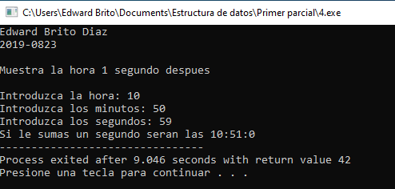

1.  Realizar un programa en C que ejecute la siguiente opcion: Incrementar el sueldo de un empleado leido por teclado en un 10 por ciento. Poner incremento como una constante.
  

 
2.  Realizar un programa en C que leea tres cantidades enteras y multiplique la cantidad por si misma y sume las tres cantidades y despliegue por pantalla el total de la suma de tres cantidades.
  

 
3.	Realizar un programa con la sentencia IF, donde digitado un numero del 1 al 7 despliegue por pantalla  el dia de la semana correspondiente a ese numero.
  

 
4.	Realizar un programa en lenguaje C con la sentencia IF donde se dije por teclado la hora, los minutos y los segundos. Introducidos estos datos, el programa desplegara por pantalla los datos introducidos sumandole 1 segundo.
  

 
5.	Una compañía de drones ofrece el servicio de furmigarb a los dueños de finca de arroz. Para este servicio tiene las siguientes tarifas.
* Fumigacion contra las malas hierbas; $10 por hectareas.
* Fumigacion contra langostas; $20 por hectareas.
* Fumigacion contra gusanos; $30 por hectareas.
* Fumigacion contra todo lo anterior; $50 por hectareas.         
   
 Si el caso a fumigar es mayor a 500 hectareas, se tiene un descuento  el 5%. Ademas, si el total a pagar por el servicio es mayor a $1500 se tiene un descuento adicional del 10% sobre el excedente. Elaborar un programa que leea los siguientes datos
* Nombre del agricultor
* Tipo de fumigacion
* Numero de hectareas a fumigar
Luego debera presentar el costo del servicio
  

 
6.	Programa que determine el area del triangulo dada la base y la altura por teclado.

  

 

7.  Determinar si es true o false .
 

 

Verdadero == 1  
Falso == 0

